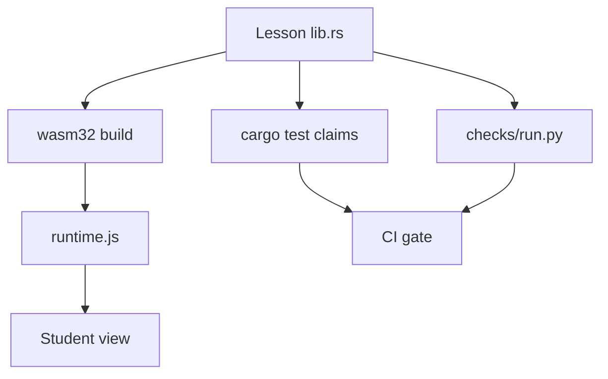

# Arquitectura — physics-lab

## Propósito

Every lesson states falsifiable claims verified in browser, Python, and cargo test on same Rust.

## Mapa de módulos

```
physics-lab/
├── lessons-common/     # lesson! macro, uniform C ABI
├── lessons/<slug>/     # Model + draw() + claim tests
├── public/js/runtime.js
├── checks/run.py       # Independent Python verification
└── tools/build-wasm.sh
```

## Diagrama de componentes



## Capas y responsabilidades

Ver [code-walkthrough.md](./code-walkthrough.md) para el recorrido módulo a módulo.

## Documentación adicional

- `docs/ARCHITECTURE.md`
- `docs/ENGINEERING.md`
- `docs/DESIGN.md`
