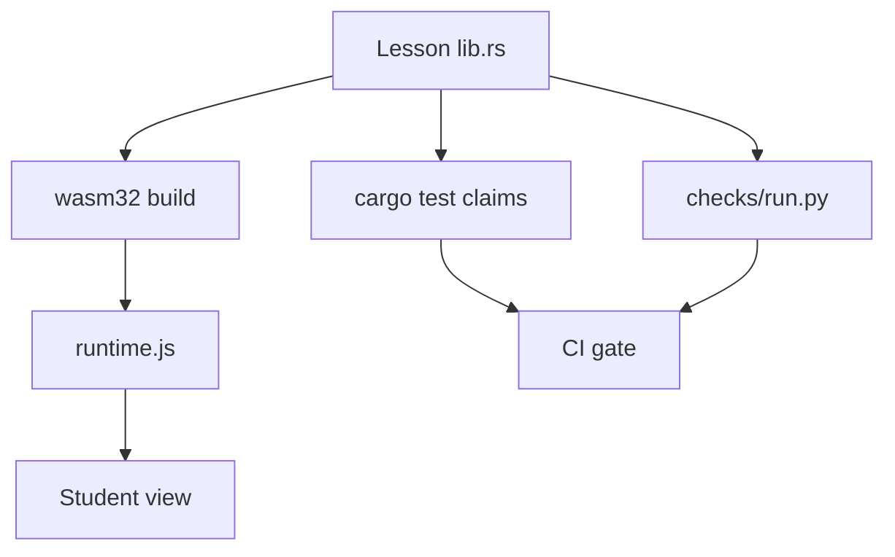
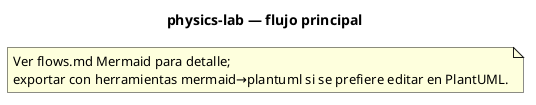

# Flujos — physics-lab

## Flujo principal

## Descripción paso a paso

1. **Author** — Write lib.rs + lesson.json + notes.html → build-wasm.sh.
1. **Student** — runtime reads lesson.json → WASM params → paint primitives.
1. **Verify** — Claim in Rust test = browser = Python cross-check.
1. **Deploy** — wrangler deploy → physics.goosethropic.systems.

## Diagrama PlantUML

Equivalente PlantUML del flujo principal (misma topología que el diagrama Mermaid):

## Estados y casos borde

Consulta los tests de integración y los RFC/requirements del proyecto para flujos de error y recuperación.
