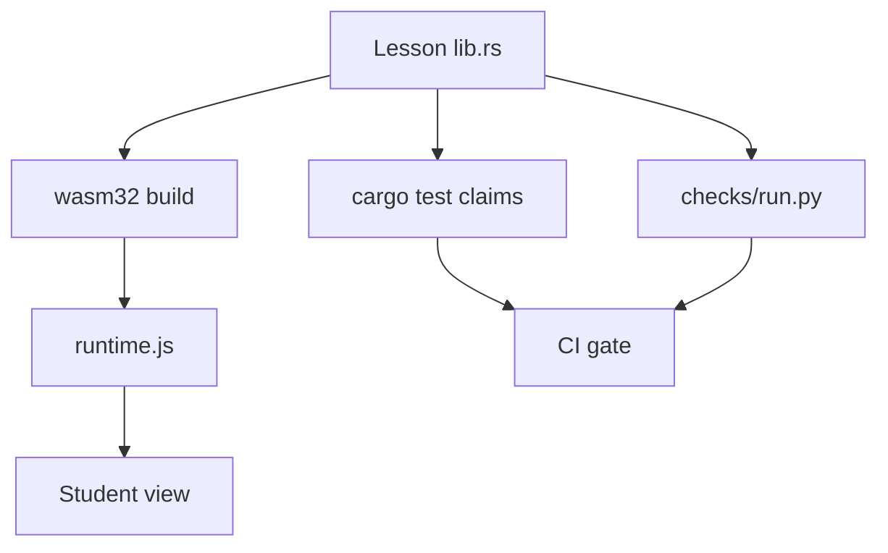
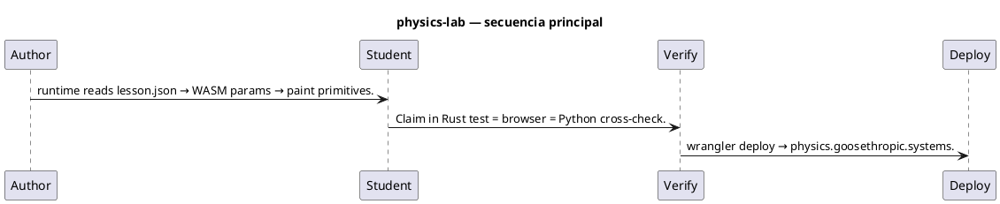
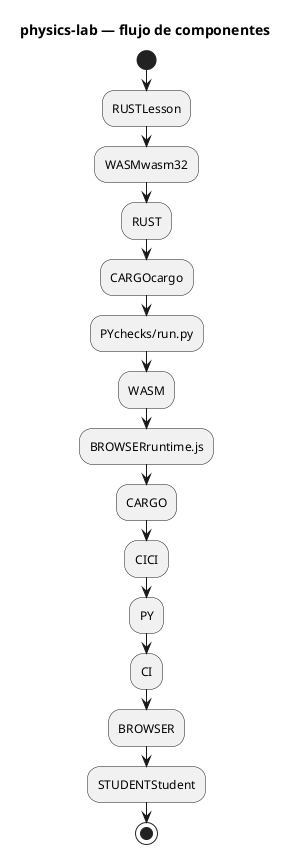

# Flujos — physics-lab

## Flujo principal (Mermaid)

## Descripción paso a paso

1. **Author** — Write lib.rs + lesson.json + notes.html → build-wasm.sh.
2. **Student** — runtime reads lesson.json → WASM params → paint primitives.
3. **Verify** — Claim in Rust test = browser = Python cross-check.
4. **Deploy** — wrangler deploy → physics.goosethropic.systems.

## Secuencia (PlantUML)

Fuente: [`diagrams/flow-sequence.puml`](./diagrams/flow-sequence.puml)

## Componentes / estados (PlantUML)

Fuente: [`diagrams/flow-architecture.puml`](./diagrams/flow-architecture.puml)

## Estados y casos borde

Consulta los tests de integración y los RFC/requirements del proyecto para flujos de error y recuperación.
